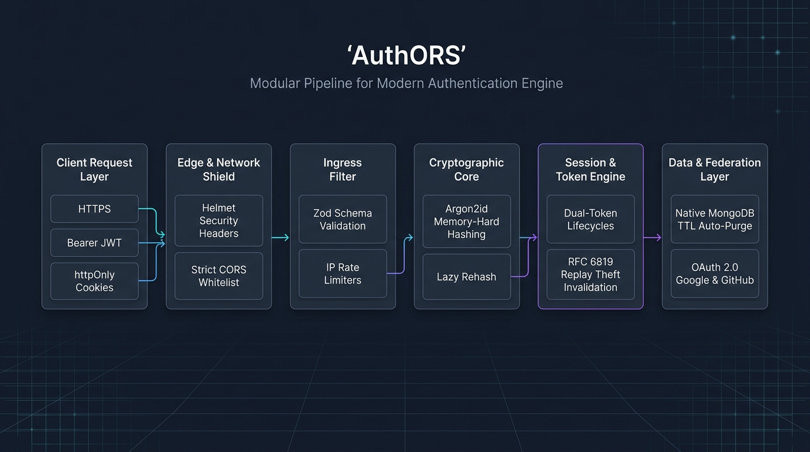
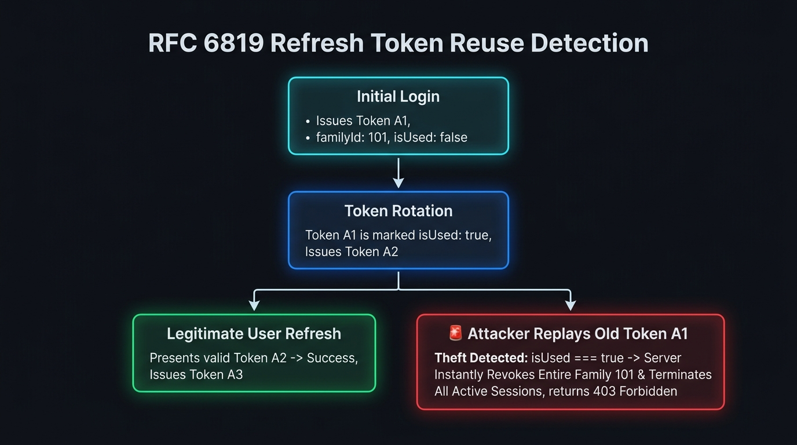

# 🛡️ Security Architecture & Threat Model

This document provides a comprehensive, technical overview of the multi-layered security architecture, cryptographic standards, threat mitigations, and engineering rationale implemented across the **AuthORS** authentication engine.

---

## Security Architecture Layers

---

## Layer 1: Network & HTTP Edge Security

### 1. Defensive HTTP Security Headers (`Helmet`)

- **Why Implemented**:
  By default, Express leaks headers like `X-Powered-By: Express`, allowing attackers to fingerprint the server stack and target known version vulnerabilities. Furthermore, web browsers default to permissive behaviors that expose users to Clickjacking and MIME-type sniffing.
- **What It Does**:
  - **`X-Frame-Options: DENY`**: Blocks Clickjacking attacks by forbidding third-party domains from embedding your authentication UI inside invisible `<iframe>` elements.
  - **`X-Content-Type-Options: nosniff`**: Forces browsers to strictly adhere to declared MIME types, preventing executable scripts disguised as images or text from executing.
  - **`Strict-Transport-Security (HSTS)`**: Instructs browsers to enforce encrypted TLS/HTTPS connections for the next 180 days (`max-age=15552000; includeSubDomains`).
  - **`X-XSS-Protection`**: Enables browser-level Cross-Site Scripting filters.
- **Why Better Than Alternatives**:
  Manual header configuration is error-prone and often misses emerging browser standards. Helmet dynamically injects 11+ industry-standard security headers on every response with zero performance overhead.

---

### 2. Strict CORS Whitelisting with Credentials

- **Why Implemented**:
  Because authentication relies on `httpOnly` secure cookies for refresh token transmission, browsers strictly restrict Cross-Origin requests. Using a wildcard (`*`) alongside cookies is a critical vulnerability.
- **What It Does**:
  - Validates the incoming `Origin` header against an explicit whitelist of trusted frontend URLs (`FRONTEND_URL`, `http://localhost:5173`, etc.).
  - Enforces `credentials: true` only for trusted origins, allowing cookies to pass securely while blocking unauthorized cross-domain access.
- **Why Better Than Alternatives**:
  Prevents CSRF token interception and cross-site data harvesting from malicious domains attempting to query your API from unauthorized origins.

---

## Layer 2: Ingress Validation & Anti-Brute-Force Protection

### 1. Granular IP Rate Limiting (`express-rate-limit`)

- **Why We Implemented This**:
  Authentication APIs are the primary target for automated botnets running **Credential Stuffing** (testing millions of breached email/password pairs) and **Dictionary Attacks** (guessing 6-digit OTP codes).
- **Matrix of Rate Limits**:

| Endpoint                             | Window | Max Requests | Threat Mitigated                                       |
| :----------------------------------- | :----: | :----------: | :----------------------------------------------------- |
| **`POST /api/auth/login`**           | 15 min |  5 requests  | Credential stuffing, brute-force password guessing     |
| **`POST /api/auth/register`**        | 1 hour |  5 requests  | Account spamming, resource exhaustion                  |
| **`POST /api/auth/verify-email`**    | 10 min |  3 requests  | 6-digit OTP permutation guessing ($10^6$ combinations) |
| **`POST /api/auth/forgot-password`** | 1 hour |  3 requests  | SMTP quota draining, email inbox flooding              |

- **Why It Is Better Than Alternatives**:
  - **Better than Captcha-on-every-request**: Avoids degrading the user experience for legitimate users while silently throttling malicious IPs.
  - **Better than in-memory manual counters**: Provides standardized `Retry-After` headers and automatic sliding window expirations.

---

### 2. Strict Request Schema Validation (`Zod`)

- **Why Implemented**:
  Traditional manual validation (`if (!req.body.email) ...`) suffers from JavaScript type-coercion bugs, NoSQL injection exploits (e.g. passing `{ "password": { "$gt": "" } }`), and uncaught runtime exceptions.
- **What It Does**:
  - **Runtime Type Safety**: Validates types, formats, and structural constraints before any controller logic executes.
  - **String Sanitization**: Trims all whitespace and converts emails to canonical lowercase strings to prevent duplicate user collisions (`John@mail.com` vs `john@mail.com`).
  - **Password Complexity**: Enforces a minimum of 8 characters containing at least 1 uppercase letter, 1 lowercase letter, 1 number, and 1 special symbol (`@$!%*?&`).
- **Why Better Than Alternatives (e.g., Joi / Manual Checks)**:
  Zod strips unknown keys, integrates seamlessly with modern TypeScript/ESM workflows, and formats human-readable error messages without leaking backend stack traces.

---

### 3. Anti-User-Enumeration

- **Why Implemented**:
  When an attacker tests emails against a "Forgot Password" or "Login" route, different error messages (e.g., _"User not found"_ vs _"Invalid password"_) reveal whether high-profile targets (like `ceo@company.com`) have accounts on the platform.
- **What It Does**:
  The `/forgot-password` endpoint always returns a generic `200 OK` response (_"If an account with that email exists, a password reset link has been sent."_), preventing account harvesting.

---

## Layer 3: Memory-Hard Password Storage & Cryptography

### 1. Argon2id Password Hashing

- **Why Implemented**:
  Traditional hashing algorithms (MD5, SHA-256, SHA-512) are designed to be fast, making them vulnerable to modern graphics cards (GPUs) and specialized ASIC chips that compute billions of guesses per second.
- **Technical Specifications**:
  - **Algorithm**: **Argon2id** (Winner of the Password Hashing Competition & OWASP Top Recommendation).
  - **Memory-Hardness**: Configured with `memoryCost: 19456` KB (~19 MB RAM per hash), `timeCost: 2`, and `parallelism: 1`.
  - **Hybrid Design**: Combines **Argon2d** (data-dependent memory access for maximum GPU resistance) with **Argon2i** (data-independent memory access for side-channel cache timing resistance).
- **Why Argon2id is Better than Bcrypt & PBKDF2**:

| Feature                  | Bcrypt          | Argon2id (AuthORS)            | Why Argon2id Wins                                                                     |
| :----------------------- | :-------------- | :---------------------------- | :------------------------------------------------------------------------------------ |
| **Memory Footprint**     | ~4 KB           | **~19 MB (Customizable)**     | GPU cores have tiny RAM; requiring 19MB per guess crashes GPU cracking rigs.          |
| **Hardware Resistance**  | CPU-bound only  | **GPU, ASIC & FPGA Proof**    | Memory-hardness makes parallel cracking economically infeasible.                      |
| **Password Truncation**  | Max 72 bytes    | **Unlimited**                 | Bcrypt silently ignores characters past 72 bytes; Argon2id supports long passphrases. |
| **OWASP Recommendation** | Legacy Standard | **#1 Primary Recommendation** | Formally recognized as the state-of-the-art password hashing standard.                |

---

### 2. Zero-Downtime Lazy-Rehash Migration Pattern

- **Why Implemented**:
  Upgrading a database from Bcrypt to Argon2id without users' plain-text passwords is traditionally impossible without forcing everyone to reset their credentials.
- **How It Works**:
  1. On login, the engine checks if the stored hash begins with `$argon2`.
  2. If it is an older Bcrypt hash (`$2b$`), it verifies the password using `bcrypt.compare()`.
  3. Upon successful verification, it **automatically re-hashes the password using Argon2id** and updates MongoDB in the background.
- **Why It Is Better**:
  Zero downtime, zero user disruption, and seamless organic database migration over normal traffic cycles.

---

## Layer 4: Dual-Token Architecture & RFC 6819 Replay Theft Detection

### 1. Dual-Token Architecture

- **Why Implemented**:
  Single long-lived JWTs (e.g. 30-day tokens) stored in browser storage cannot be invalidated if stolen without querying the database on every single API request, destroying the performance benefits of JWTs.
- **What It Does**:
  - **Access Token (Short-Lived: 15m)**: Stateless VIP pass stored in memory and sent via `Authorization: Bearer` headers. If intercepted, the attacker's window of opportunity is limited to 15 minutes.
  - **Refresh Token (Long-Lived: 7d)**: Stored as a SHA-256 digest in database sessions, used exclusively to rotate access tokens.

---

### 2. Secure Cookie Storage (`httpOnly`, `secure`, `sameSite`)

- **Why Implemented**:
  Storing tokens in `localStorage` or `sessionStorage` exposes them to any malicious third-party npm package, CDN script, or browser extension via Cross-Site Scripting (XSS).
- **Security Flags**:
  - **`httpOnly: true`**: JavaScript running in the browser (`document.cookie`) cannot read or access the cookie $\rightarrow$ **100% immune to XSS token theft**.
  - **`secure: true`**: Transmitted exclusively over encrypted HTTPS connections, preventing man-in-the-middle sniffing.
  - **`sameSite: strict`**: The cookie is never sent with requests initiated by third-party sites $\rightarrow$ **Eliminates Cross-Site Request Forgery (CSRF)**.

---

### 3. RFC 6819 Token Family Invalidation (Theft Detection Engine)

- **Why Implemented**:
  Standard token rotation alone is insufficient: if a hacker steals a refresh token and uses it before the legitimate user, both parties would receive separate valid tokens indefinitely.
- **How It Works**:
  - Every login generates a unique **`familyId`** UUID.
  - When rotating tokens, the parent token is marked as `isUsed: true` and a descendant session is spawned in the same family.
  - If an **already-used or revoked token is ever presented again**, the server detects a token replay attack, **immediately revokes all active sessions across that entire family lineage**, clears the client cookie, and returns `403 Forbidden`.
- **Why It Is Better**:
  Converts token theft from an undetectable vulnerability into an actionable security event that automatically terminates compromised sessions.

---

## Layer 5: Ephemeral Token Lifecycle & MongoDB TTL Purging

### 1. Automated MongoDB TTL Auto-Deletion

- **Why Implemented**:
  Storing temporary OTPs and reset tokens permanently in the database bloats storage and creates a security risk if stale tokens remain valid.
- **What It Does**:
  - **OTPs (`otps` collection)**: Configured with a native MongoDB index `{ createdAt: 1 }, { expireAfterSeconds: 600 }` (10 minutes).
  - **Password Resets (`password_resets` collection)**: Configured with `{ createdAt: 1 }, { expireAfterSeconds: 900 }` (15 minutes).
- **Why It Is Better Than Cron Jobs**:
  - Runs directly inside MongoDB’s background C++ engine thread with zero application memory overhead.
  - Guaranteed execution even if Node.js server restarts or experiences downtime.

---

### 2. High-Entropy 32-Byte Cryptographic Tokens

- **Why Implemented**:
  Short or predictable reset links (e.g. timestamp hashes or 6-digit PINs) can be guessed via parallel HTTP requests.
- **What It Does**:
  Password reset tokens are generated using cryptographically secure pseudorandom numbers (`crypto.randomBytes(32)` $\rightarrow$ 64 hex characters), providing $2^{256}$ ($1.15 \times 10^{77}$) possible combinations, rendering brute-forcing mathematically impossible.
- **Immediate Single-Use Consumption**:
  The moment a token is verified during `/verify-email` or `/reset-password`, the document is immediately deleted from the database (`deleteMany`), guaranteeing zero token reuse.

---

## Layer 6: Federated Social Authentication (OAuth 2.0 / OIDC)

### 1. Passport.js Integration (Google & GitHub)

- **Why Implemented**:
  Passwords are the #1 attack vector for user accounts (phishing, weak passwords, credential reuse). OAuth 2.0 delegates authentication to battle-tested identity providers.
- **What It Does**:
  - Implements the official **OAuth 2.0 Authorization Code Flow**.
  - **Pre-Verified Emails**: Social accounts are automatically verified (`verified: true`) because Google/GitHub have already verified email ownership.
  - **Account Linking**: If a user previously registered with a local password and later clicks "Sign in with Google", the system links their `googleId` to the existing account without creating duplicate user records.
  - **Username Collision Fallback**: Automatically appends random identifiers if a social display name collides with an existing username, preventing MongoDB duplicate key crashes.

---

## Layer 7: Session Management & Multi-Device Revocation

### 1. Comprehensive Device & Session Auditing

- **Why Implemented**:
  Users need visibility into which devices are logged into their accounts and the ability to remotely terminate compromised sessions.
- **What It Does**:
  - Every session records the client's **IP address**, **Device User-Agent**, and timestamp.
  - **Single-Device Logout (`POST /api/auth/logout`)**: Revokes only the active token family and clears the client's cookie.
  - **Universal Account Kill-Switch (`POST /api/auth/logout-all`)**: Revokes every active session across all devices globally (`sessionModel.updateMany({ user: id }, { revoked: true })`).
  - **Password Reset Revocation**: Successfully resetting a password automatically revokes all existing sessions across all phones, tablets, and PCs worldwide.

---

## Summary: How AuthORS Compares to Industry Standards

| Security Dimension         |       Basic Auth Tutorial       |   Standard SaaS Boilerplate   |                🛡️ AuthORS Enterprise Engine                 |
| :------------------------- | :-----------------------------: | :---------------------------: | :---------------------------------------------------------: |
| **Password Storage**       |          Plain SHA-256          |      Bcrypt (10 rounds)       |        **Argon2id (19MB Memory-Hard) + Lazy Rehash**        |
| **Token Theft Mitigation** |        None (Single JWT)        | Basic Rotation (No detection) |        **RFC 6819 Token Family Invalidation & Wipe**        |
| **Token Storage**          | `localStorage` (XSS vulnerable) |         Basic Cookie          |    **`httpOnly` + `secure` + `sameSite: strict` Cookie**    |
| **Brute-Force Protection** |              None               |      Global Rate Limiter      |  **Granular IP-based Limiters on all 4 sensitive routes**   |
| **Payload Sanitization**   |       Manual `if` checks        |           Basic Joi           |    **Zod Schema Parsing, Normalization & Sanitization**     |
| **Ephemeral Data Purging** |       Kept in DB forever        |      `node-cron` script       |      **Native MongoDB Background Engine TTL Indexes**       |
| **HTTP Security**          |     Default Express headers     |          Basic CORS           |   **Helmet (11+ Defensive Headers) + Strict Origin CORS**   |
| **Account Recovery**       |     Predictable Reset Link      |          Basic Token          | **32-Byte CSPRNG Token ($2^{256}$ entropy) + Session Wipe** |
| **Social Logins**          |              None               |  Basic OAuth (Creates dupes)  | **Passport OAuth2 (Google/GitHub) + Auto Account Linking**  |

---

## 🚨 Vulnerability Disclosure & Responsible Reporting

If you discover a security vulnerability within this repository, please report it responsibly by contacting the me directly. Avoid creating public GitHub issues for sensitive security exploits.
